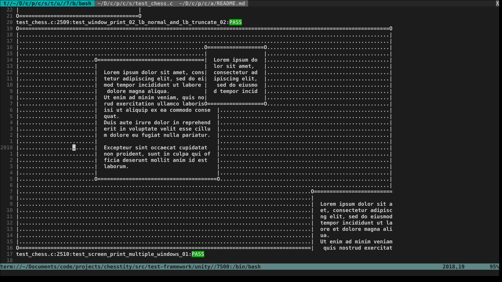
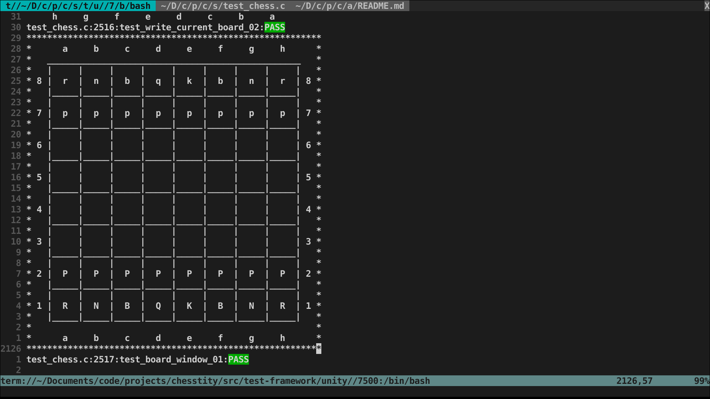
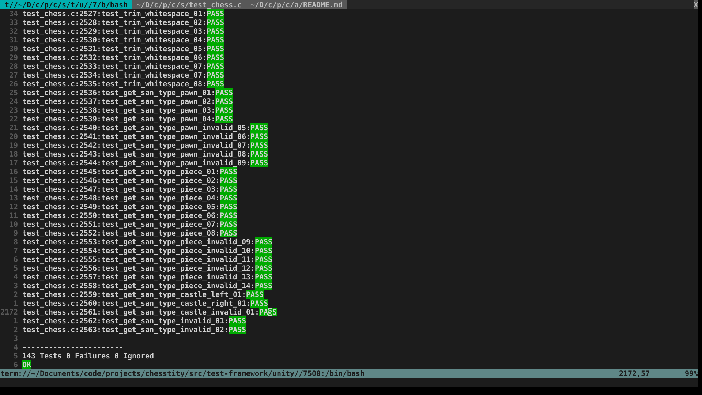

<!--
Copyright: (c) 2023, Alrik Neumann
GNU General Public License v3.0+ (see LICENSE.txt or https://www.gnu.org/licenses/gpl-3.0.txt)
-->

# Chesstity

This is a not yet functional command-line chess-game written in C.

## History of the project

After spending a couple of months working through my first full programming book, this was my first attempt to write a project larger than any of the exercises I had completed so far.

I as the main goal with this project was to challenge my problem solving skills I intentionally skipped researching on how one usually would go about implementing a chess game. I also did not use any third-party-libraries (except for testing purposes).

Although I have not actively developing this project during the last months it already consists of a couple of thousand rigorously tested lines of code and just waits for me to pick it up again and finish it.

## Some implementation details

### Core Functionality

The execution of the program revolves around altering Game-objects which by themselves are linked-lists of Game_state-objects, which in their turn store information like the current board state, who has castled or moved their king yet, who's turn it is etc.
This way it is easy to check for draw conditions like the *threefold-repetition-rule*, implement the possibility to take back moves etc.

### User-Interface

#### Presentation

The game's presentation largely depending on a primitive TUI-library I wrote inside of `tui_lib.c` and `tui_lib.h`. 
This library provides two kinds of objects: *screens* and *windows*
While screens and windows can be created and destroyed independently. Screens will generally be enriched by a collection of windows, which are added to them with different display priorities. When a screen gets printed all content of the windows inside of it will be saved to a single string according to the windows priorities, then this string will be printed to the terminal.
For each screen and window many different parameters can be altered, like padding, background, size, positioning etc.
When a window get's deleted, it will also be removed from all screens holding it. When a screen gets deleted, the windows, which were inside of it continue to exists and can be added to other screens. Each window can be part of multiple screens at the same time.

testing `tui_lib.c`

prototype of the main game-window

#### Input

The Program accepts input in [standard algebraic notation](https://en.wikipedia.org/wiki/Algebraic_notation_(chess)). The current challenge is to finish writing the functionality for input parsing.

### Testing

Using the [Unity](http://www.throwtheswitch.org/unity) testing-framework, I followed a rigorous testing routine while developing this. Knowing that the large majority of the so far written code works as intended makes me confident that I will eventually finish this project. All the tests are written inside of `test_chess.c` and can be run by using the `make test` command inside of `chesstity/src`.

a part of the output of `make test`
